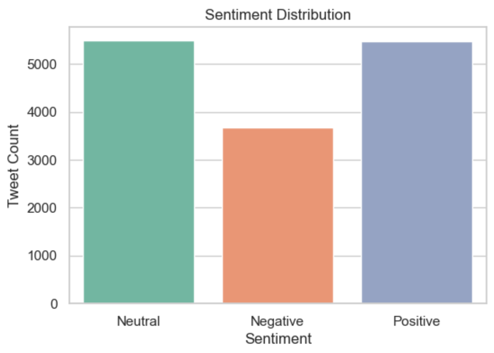
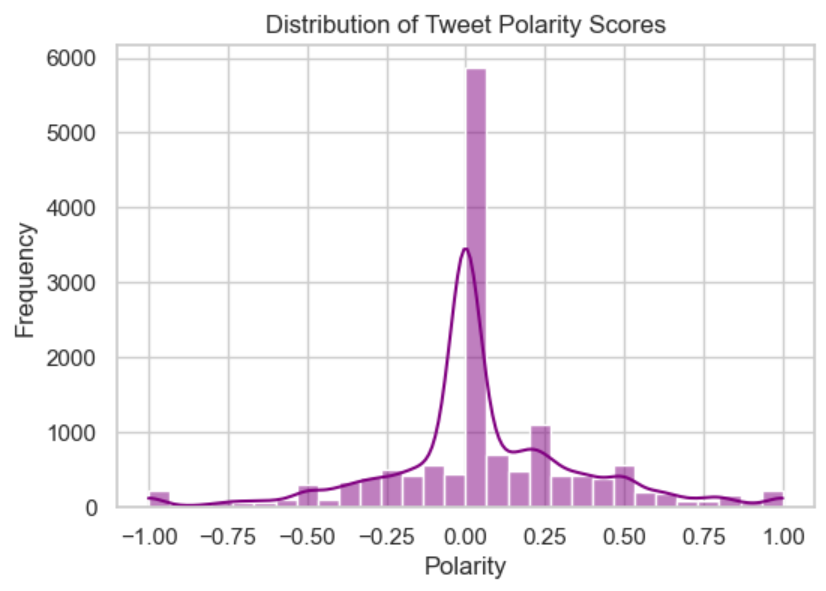
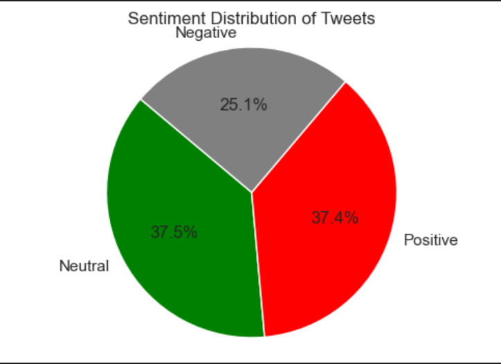
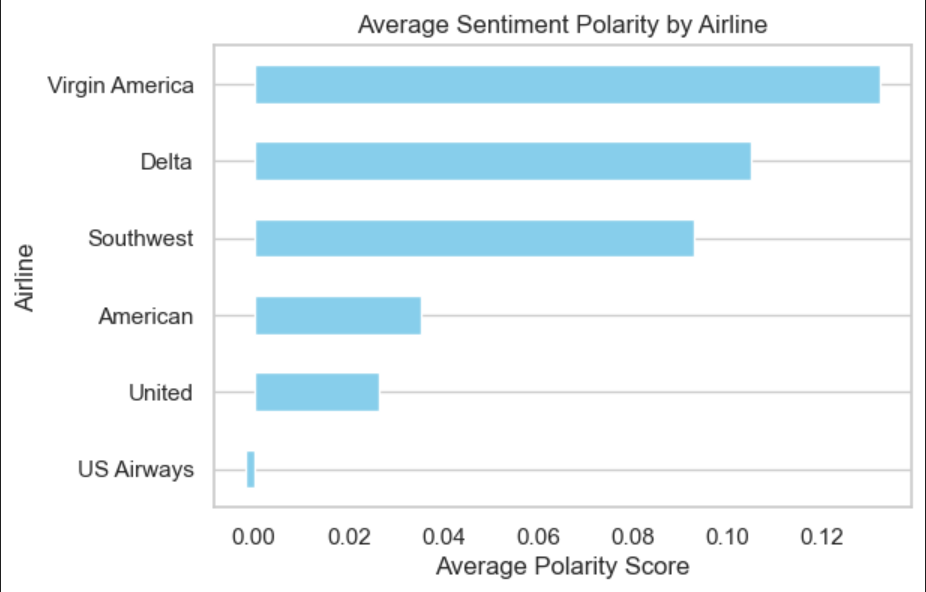

# ✈️ Airline Tweets Sentiment Analysis

## 📌 Introduction

This project is part of my **internship in Data Science and Analytics**. The goal is to perform **sentiment analysis** on airline tweets to identify whether customer feedback is **positive**, **neutral**, or **negative**. Using a labeled dataset, I cleaned the data, analyzed the sentiment polarity, and created meaningful visualizations to gain insights.

---

## 🧠 Background

Social media platforms, especially Twitter, serve as a major source of real-time customer feedback. Airline companies can gain valuable insights by analyzing the sentiment of tweets directed at them. This helps in:

- Understanding customer satisfaction levels.
- Identifying pain points or service failures.
- Improving engagement and service quality.

---

## 🛠 Tools I Used

- **Python**: Data analysis and visualization.
- **Pandas**: For data manipulation.
- **Matplotlib & Seaborn**: For creating charts and graphs.
- **TextBlob**: To calculate polarity of the tweets.
- **Jupyter Notebook**: For writing and running the code.

---

## 📊 The Analysis

### 1. Sentiment Distribution  
This visualization shows the overall count of **Positive**, **Negative**, and **Neutral** tweets.

 

---

### 2. Sentiment Distribution by Airline  
This chart breaks down sentiment for each airline to identify customer perception airline-wise.

 

---

### 3. Distribution of Polarity Scores  
A histogram that displays the distribution of **polarity scores** (ranging from -1 to 1), representing how positive or negative tweets are.

---

### 4. Proportion of Sentiment (Pie Chart)  
A pie chart showing the percentage share of Positive, Negative, and Neutral tweets.

 

---

### 5. Average Sentiment Polarity by Airline  
This bar chart displays the **mean polarity score** per airline to measure general positivity or negativity.

---

## 📚 What I Learned

- How to preprocess and clean text data for analysis.
- Performing sentiment classification using polarity values.
- Visualizing data with Matplotlib and Seaborn.
- Gained a deeper understanding of how businesses can leverage social media data.
- Developed critical thinking on interpreting sentiment scores and visual patterns.

---

## ✅ Conclusion

This project enhanced my **analytical thinking and data storytelling skills**. It demonstrates how sentiment analysis can provide actionable insights for companies by analyzing customer feedback. I now feel more confident in working with real-world datasets and deriving insights through visualizations.

---

## 👨‍💻 Author

**Mohammed Aqlath A**  
Intern – Data Science and Analytics  
linkedIn :  www.linkedin.com/in/mohammed-aqlath-a-26baa3248